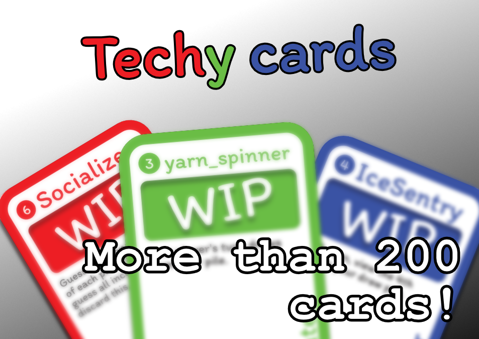

# Techy cards

Techy cards is a card game for rustlang, bevy and tech enthusiasts: the perfect opportunity to kill time in between tech conferences!

With quick games for less than 5 minutes, let's determine who pays the latte for the afterparty.

The goal of the game is to assemble technologist members, tools and techniques to score more points than your opponents.

The rules are simple:

- Draw a card.
- Play a card.

One card at a time, turns are quick and easy, but will you keep track of the points until the 8th round ?

Already more than 160 cards to get your tech ecosystem knowledge freshened up with these ice-breaker prone descriptions, what are you waiting for?

## Detailed rules

See [HOW_TO_PLAY.md](docs/HOW_TO_PLAY.md)

If you are interesting in more design considerations, consider reading [DESIGN.md](docs/DESIGN.md).

## Editions

Cards are grouped in "editions" of 60-120 cards, these editions are meant to:

- Be printed together, and played together, but all cards from all editions are mostly compatible.
- Have a theme, and/or a "star feature" with a unique twist to it.
- Be part of a "release" plan.

For current list of editions, refer to [Editions](/editions).
