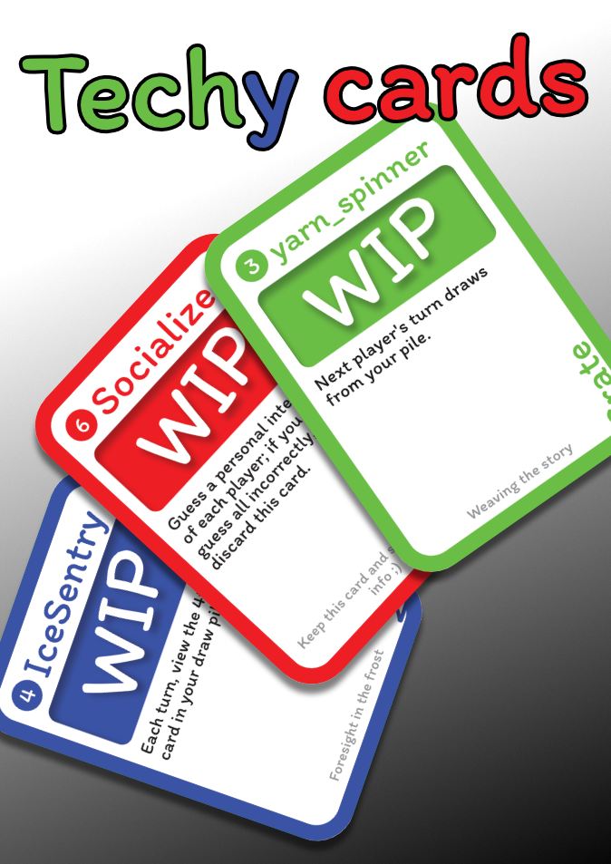

# Techy cards

Techy cards is a card game for rustlang, bevy and tech enthusiasts: the perfect opportunity to kill time in between tech conferences!

With quick games for less than 5 minutes, let's determine who pays the latte for the afterparty.

The goal of the game is to assemble technologist members, tools and techniques to score more points than your opponents.

The rules are simple:

- Draw a card.
- Play a card.

1 card at a time, turns are quick and easy, but will you keep track of the points until the 8th round ?

Get your tech ecosystem knowledge freshened up with these ice-breaker cards, get the best line up!

## Detailed rules

See [HOW_TO_PLAY.md](docs/HOW_TO_PLAY.md)

If you are interesting in more design considerations, consider reading [DESIGN.md](docs/DESIGN.md).

## Editions

Cards are grouped in "editions" of 60-120 cards, these editions are meant to:

- Be printed together, and played together.
- Have a theme, and/or a "star feature" with a unique twist to it.
- A "release" plan.

Current list of editions:

- 2024/09: Paris Rust Meetup #70
  - Themed edition on rust conferences, where most of members are "attendees".
- 2024/10: Launch
  - Star card: "open source", which both sides show the description, a reference to this game being open sourced, focused on bevy community.
- Next edition(s)
  - WIP