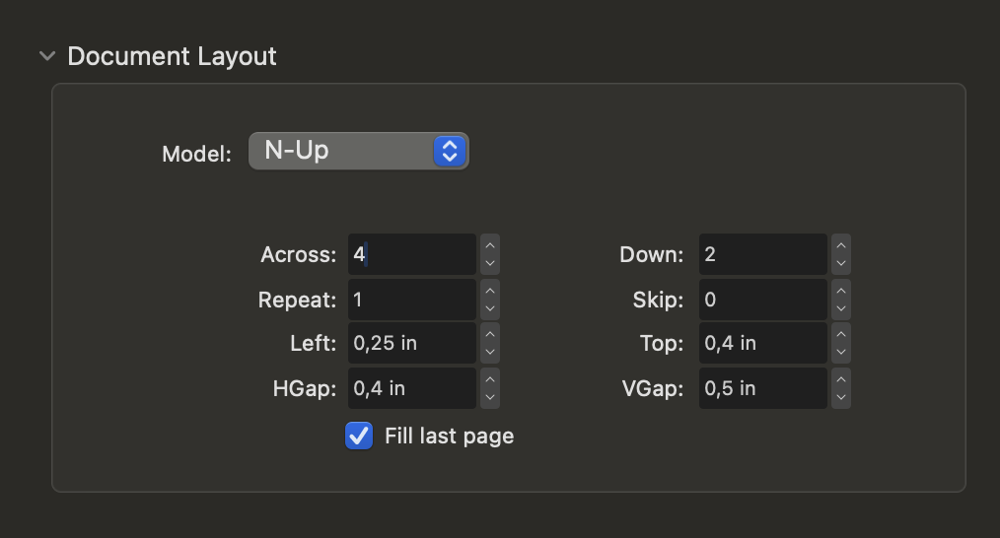

# Contributing

Techy cards is open source. That means you can print your cards and distribute them for the conference you're organizing! Contact me if you do <3

## Development process

[Affinity Publisher](https://affinity.serif.com/fr/publisher/) is used to create the card printables.

To create card files:

- Each edition lives within `editions/`, where you'll find some details about the edition, the sources, and affinity files used to generate the cards.
- Templates are in `/templates`
- Create cards using [data merge](https://affinity.help/publisher2/English.lproj/index.html?page=pages/Advanced/dataMerge.html&title=Data%20merge). The process is not fully automated as we need to edit the output `.afpub` to fix overflowing text, or adapt special cards (special back, emojis, text color...)
- All cards should ideally have some free space to write modifications on them.

To print:

- Print backs and fronts independently

Here is current setup

- Document layout: N-Up
- Across: 4
- Down: 2
- Left: 0.25 in
- Top: 0.4 in
- HGap: 0.4 in
- VGap: 0.5 in

- Ideally color their back in black to limit the see-through.
- Glue them together
- Laminate them, so players can use temporary markers on them.

Other techniques involve printing both back and front on the same paper, then folding it on itself.
Adding a sheet in between is the usual technique, to limit see-through even more. With laser printing, I found out it's ok for prototype cards.

See https://youtu.be/WyMVRJu5yQ4?t=1186 for ideas.